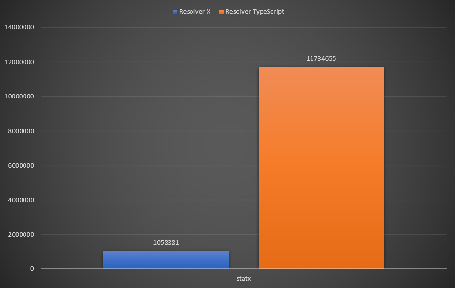

# eslint-import-resolver-x

This resolver adds [`TypeScript`][] or [`JavaScript`][] import support to [`eslint-plugin-import`][] with `tsconfig.json` or `jsconfig.json` aliases (`compilerOptions.paths`)

### Performance

This is fork of [`eslint-import-resolver-typescript`][] but much faster and more efficient. You can save time on project linting by **(~30-40%)**.



We use `strace` package for count of [fstat](`https://nodejs.org/api/fs.html#fsfstatsyncfd-options`) call when linting codebase

For example you codebase has multiple packages with 100 000 LOC ()

> The following data depends directly on the number of imports in your case, but the comparison table is filled with data on the same code base

| syscall    | eslint-import-resolver-x | eslint-import-resolver-typescript |
| ---------- | ------------------------ | --------------------------------- |
| access     | 52 900                   | 50 641                            |
| chdir      | 1                        | 1                                 |
| execve     | 78                       | 78                                |
| faccessat2 | 1                        | 1                                 |
| getcwd     | 3                        | 3                                 |
| mkdir      | 2                        | 2                                 |
| newfstatat | 31 761                   | 32 137 🔺                         |
| openat     | 74 965                   | 81 592 🔺                         |
| readlink   | 1 183 525                | 1 194 240 🔺                      |
| statfs     | 2                        | 2                                 |
| statx      | 1 058 381                | 11 734 655 🔺                     |
| unlink     | 3                        | 2                                 |

We are interested in how many accesses to the file system occurred during the linting process.

For example we can pay attention to `statx` syscall.

`eslint-import-resolver-x` makes **10 MILLION fewer** `statx` calls

**If you notice an increase in linting performance in your CI on large code bases, write your feedback [here](https://github.com/helljs/eslint-import-resolver-x/discussions/1)**

## Description

You can:

- `import`/`require` files with extension any extenstions of `js` or `ts`
- Use [`paths`](https://www.typescriptlang.org/docs/handbook/module-resolution.html#path-mapping) defined in `tsconfig.json` or `jsconfig.json`
- Multiple tsconfigs or jsconfigs support
- `imports/exports` fields support in `package.json`

## Installation

```sh
# npm
npm i -D eslint-plugin-import @helljs/eslint-import-resolver-x

# pnpm
pnpm i -D eslint-plugin-import @helljs/eslint-import-resolver-x

# yarn
yarn add -D eslint-plugin-import @helljs/eslint-import-resolver-x
```

## Configuration

Add the following to your `.eslintrc` config:

### TypeScript

```jsonc
{
  "plugins": ["import"],
  "rules": {
    // turn on errors for missing imports
    "import/no-unresolved": "error",
  },
  "settings": {
    "import/parsers": {
      "@typescript-eslint/parser": [".ts", ".tsx"],
    },
    "import/resolver": {
      "@helljs/eslint-import-resolver-x": {
        "alwaysTryTypes": true, // always try to resolve types under `<root>@types` directory even it doesn't contain any source code, like `@types/unist`

        // Choose from one of the "project" configs below or omit to use <root>/tsconfig.json by default

        // use <root>/path/to/folder/tsconfig.json
        "project": "path/to/folder",

        // Multiple tsconfigs (Useful for monorepos)

        // use a glob pattern
        "project": "packages/*/tsconfig.json",

        // use an array
        "project": ["packages/module-a/tsconfig.json", "packages/module-b/tsconfig.json"],

        // use an array of glob patterns
        "project": ["packages/*/tsconfig.json", "other-packages/*/tsconfig.json"],
      },
    },
  },
}
```

### JavaScript

```jsonc
{
  "plugins": ["import"],
  "rules": {
    // turn on errors for missing imports
    "import/no-unresolved": "error",
  },
  "settings": {
    "import/parsers": {
      "@babel/eslint-parser": [".js", ".mjs"],
    },
    "import/resolver": {
      "@helljs/eslint-import-resolver-x": {
        // use <root>/path/to/folder/jsconfig.json
        "project": "path/to/folder",

        // Multiple jsconfigs (Useful for monorepos)

        // use a glob pattern
        "project": "packages/*/jsconfig.json",

        // use an array
        "project": ["packages/module-a/jsconfig.json", "packages/module-b/jsconfig.json"],

        // use an array of glob patterns
        "project": ["packages/*/jsconfig.json", "other-packages/*/jsconfig.json"],
      },
    },
  },
}
```

You can use this resolver for mixed codebase with javascript & typescript:

```jsonc
"settings": {
  "import/parsers": {
    "@babel/eslint-parser": [".js", ".mjs"],
    "@typescript-eslint/parser": [".ts", ".tsx"],
  },
  "import/resolver": {
    "@helljs/eslint-import-resolver-x": {
      "project": ["packages/*/tsconfig.json", "packages/*/jsconfig.json"],
    },
  },
}
```

## Options from [`enhanced-resolve`][]

#### `conditionNames` - [See default](src/default.ts#1)

#### `extensions` - [See default](src/default.ts#20)

#### `extensionAlias` - [See default](src/default.ts#22)

### `mainFields` - [See default](src/default.ts#35)

### Other options

You can pass through other options of [`enhanced-resolve`][] directly

## License

[ISC][]

[`eslint-plugin-import`]: https://www.npmjs.com/package/eslint-plugin-import
[`enhanced-resolve`]: https://www.npmjs.com/package/enhanced-resolve
[`typescript`]: https://www.typescriptlang.org
[`javascript`]: https://ecma-international.org/
[isc]: https://opensource.org/licenses/ISC
[`eslint-import-resolver-typescript`]: https://www.npmjs.com/package/eslint-import-resolver-typescript
